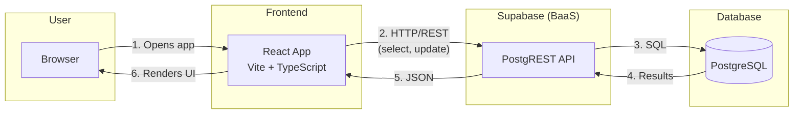

# Easy Health

## 1. App Summary

Easy Health is a single-dashboard application that helps people understand and manage their health insurance and care in one place. The core problem it solves is the fragmentation of health information — members currently have to juggle multiple portals to track balances, copays, appointments, and providers. The primary user is a health plan member, whether an individual or a family, who wants a unified view of their coverage and care. Easy Health provides a **Dashboard** showing balance due and the next appointment, an **Appointments** section for viewing, scheduling, and rescheduling upcoming and past visits, a **Medical Profile** with plan details and assigned doctors, and a **Resources** section with health articles. The app also features an AI-style assistant on the home page to answer common insurance questions. All actions — including rescheduling — persist to a database and are reflected immediately after a page refresh.

---

## 2. Tech Stack

| Layer | Technologies |
|-------|--------------|
| **Frontend** | React 18, TypeScript, Vite 5 |
| **UI & Styling** | Tailwind CSS, shadcn/ui (Radix UI), Lucide icons |
| **Routing & Data** | React Router 6, TanStack React Query |
| **Backend / API** | Supabase (PostgREST API) |
| **Database** | PostgreSQL (hosted via Supabase) |
| **Authentication** | Not used for login in the current vertical slice; app uses a fixed user context. Supabase Auth is available in the client for future use. |
| **External Services** | Supabase (database, API, optional auth). No other external APIs in the current slice. |

---

## 3. Architecture Diagram

The following diagram shows how the user, frontend, Supabase, and database interact. The frontend runs in the browser and communicates directly with Supabase, which provides both the API layer and the hosted database.



**Labeled flow:**

1. **User → Frontend:** User opens the app in the browser (e.g. `http://localhost:8080`).
2. **Frontend → Supabase:** The React app sends HTTP requests to the Supabase PostgREST API (e.g. `GET/PATCH /rest/v1/appointments`).
3. **Supabase → Database:** Supabase translates those requests into SQL and runs them against PostgreSQL.
4. **Database → Supabase:** PostgreSQL returns rows to Supabase.
5. **Supabase → Frontend:** Supabase returns JSON to the React app.
6. **Frontend → User:** The app updates the UI with the returned data.

There is no separate application server — the "backend" is entirely Supabase's managed API and database.

---

## 4. Prerequisites

The following software is required to run the project locally:

| Software | Purpose | Verify |
|----------|---------|--------|
| **Node.js** (LTS, e.g. 20.x) | Runtime for the frontend and tooling | `node --version` |
| **npm** | Package manager (bundled with Node.js) | `npm --version` |
| **Supabase account** | Hosted PostgreSQL and REST API | See below |

**Installation instructions:**

- **Node.js:** Download the LTS version from [https://nodejs.org/](https://nodejs.org/). After installing, verify with `node --version` (expected output: `v20.x.x` or similar).
- **npm:** Bundled with Node.js. Verify with `npm --version`. Alternatively, [Bun](https://bun.sh/) is supported — verify with `bun --version`.
- **Supabase:** Create a free account at [https://supabase.com](https://supabase.com). Once signed in, create a new project to get a Project URL and anon key. No local PostgreSQL or `psql` installation is required — Supabase hosts the database for you.

---

## 5. Installation and Setup

**Step 1 — Clone the repository**
```bash
git clone <YOUR_GIT_URL>
cd health-navigator-1
```

**Step 2 — Install dependencies**
```bash
npm install
```
(Or `bun install` if you use Bun.)

**Step 3 — Create a Supabase project**

Go to [app.supabase.com](https://app.supabase.com) and create a new project. Wait for the database to be ready, then open the **SQL Editor** from the left sidebar.

**Step 4 — Apply the schema and seed data**

In the Supabase SQL Editor:
1. Open the file at `supabase/migrations/` in this repo and run the `.sql` migration file. This creates all tables and row-level security (RLS) policies the app requires. Alternatively, run `schema.sql` manually and apply the RLS policies from the migration file, or use the [Supabase CLI](https://supabase.com/docs/guides/cli) and run `supabase db push`.
2. Run `seed.sql` in the SQL Editor to insert demo data — including the demo user (Chad), providers, plans, appointments, and articles.

**Step 5 — Configure environment variables**

Copy the example environment file:
```bash
cp .env.example .env
```

In Supabase, navigate to **Project Settings → API** and copy the following values:
- **Project URL** → `VITE_SUPABASE_URL`
- **anon public key** → `VITE_SUPABASE_PUBLISHABLE_KEY`

Paste them into your `.env` file:
```
VITE_SUPABASE_URL=https://xxxxxxxx.supabase.co
VITE_SUPABASE_PUBLISHABLE_KEY=eyJhbGciOiJIUzI1NiIsInR5cCI6IkpXVCJ9...
```

Restart the dev server after saving changes to `.env`.

---

## 6. Running the Application

Start the frontend development server:
```bash
npm run dev
```

Then open the app in your browser at:
```
http://localhost:8080
```

There is no separate backend process to start — the backend is Supabase. The app will connect to your Supabase project using the credentials in `.env` and load all data automatically.

---

## 7. Verifying the Vertical Slice

This section walks through one end-to-end slice: **rescheduling an appointment**, confirming the database was updated, and verifying the change persists after a page refresh.

**Step 1 — Trigger the feature (reschedule)**

1. Open [http://localhost:8080](http://localhost:8080).
2. Navigate to **Dashboard** (or go directly to `/dashboard`).
3. In the **Next Appointment** card, click **Reschedule**.
4. In the dialog, select a new date (e.g. any future date) and a new time (e.g. "2:00 PM"), then click **Confirm Reschedule**.
5. You should see a success toast notification and the card should immediately reflect the updated date and time.

**Step 2 — Confirm the database was updated**

1. In [Supabase](https://app.supabase.com), open your project and go to **Table Editor → appointments**.
2. Locate the row you just rescheduled (e.g. `appt_id = 1` for the first upcoming appointment).
3. Check the `date_time` column — it should match the new date and time you selected (stored in UTC).

**Step 3 — Verify persistence after refresh**

1. In the browser, refresh the page (`F5` or `Cmd+R` / `Ctrl+R`).
2. The **Next Appointment** card and the **Upcoming** appointments list should still display the updated date and time.
3. This confirms the change was written to PostgreSQL and is correctly read back on load.

**Summary of the slice:** UI (Reschedule) → Supabase API (`PATCH /appointments`) → PostgreSQL (`UPDATE`) → UI (refetch and re-render).
