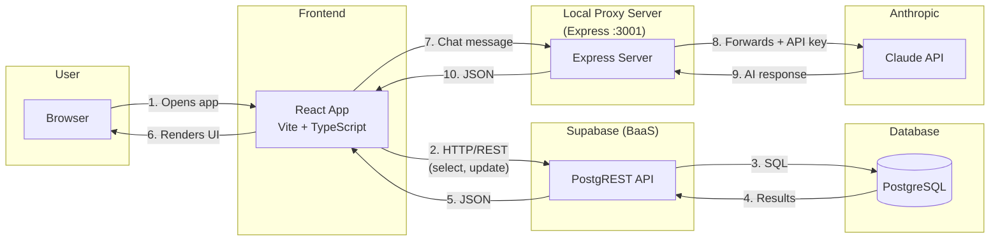

# Easy Health

## 1. App Summary

Easy Health is a single-dashboard application that helps people (particularly targeting young adults new to the world of health insurance and general independency) understand and manage their health insurance and care in one place. The core problem it solves is the fragmentation of health information — members currently have to juggle multiple portals to track balances, copays, appointments, and providers. The primary user is a health plan member, whether an individual or a family, who wants a unified view of their coverage and care. Easy Health provides a **Dashboard** showing balance due and the next appointment, an **Appointments** section for viewing, scheduling, and rescheduling upcoming and past visits, a **Medical Profile** with plan details and assigned doctors, and a **Resources** section with health articles. Scheduling and rescheduling respect **provider unavailability** (blocked dates/times in the database) and **30-minute** visit slots so users cannot pick times that conflict with another patient’s appointment or a blocked period. The app also features an AI assistant on the home page powered by Claude to answer personalized insurance questions. All actions — including rescheduling — persist to a database and are reflected immediately after a page refresh.

---

## 2. Tech Stack

| Layer                 | Technologies                                                                                                                              |
| --------------------- | ----------------------------------------------------------------------------------------------------------------------------------------- |
| **Frontend**          | React 18, TypeScript, Vite 5                                                                                                              |
| **UI & Styling**      | Tailwind CSS, shadcn/ui (Radix UI), Lucide icons                                                                                          |
| **Routing & Data**    | React Router 6, TanStack React Query                                                                                                      |
| **Backend / API**     | Supabase (PostgREST API)                                                                                                                  |
| **Database**          | PostgreSQL (hosted via Supabase)                                                                                                          |
| **AI Assistant**      | Anthropic Claude API (claude-sonnet-4), proxied via local Express server                                                                  |
| **Authentication**    | Email/password signup + login via a custom `users` table (hashed password); after signup/login the user selects an insurance plan. Supabase Auth is not used yet. |
| **External Services** | Supabase (database, API, optional auth), Anthropic Claude API (AI assistant)                                                              |

---

## 3. Architecture Diagram

The following diagram shows how the user, frontend, proxy server, Supabase, and Claude API interact.


```mermaid
flowchart LR
    subgraph User
        Browser[Browser]
    end

    subgraph Frontend
        React[React App\nVite + TypeScript]
    end

    subgraph Proxy["Local Proxy Server\n(Express :3001)"]
        Express[Express Server]
    end

    subgraph Supabase["Supabase (BaaS)"]
        API[PostgREST API]
    end

    subgraph Database
        PostgreSQL[(PostgreSQL)]
    end

    subgraph AI["Anthropic"]
        Claude[Claude API]
    end

    Browser -->|"1. Opens app"| React
    React -->|"2. HTTP/REST\n(select, update)"| API
    API -->|"3. SQL"| PostgreSQL
    PostgreSQL -->|"4. Results"| API
    API -->|"5. JSON"| React
    React -->|"6. Renders UI"| Browser
    React -->|"7. Chat message"| Express
    Express -->|"8. Forwards + API key"| Claude
    Claude -->|"9. AI response"| Express
    Express -->|"10. JSON"| React
```

**Labeled flow:**

1. **User → Frontend:** User opens the app in the browser (e.g. `http://localhost:8080`).
2. **Frontend → Supabase:** The React app sends HTTP requests to the Supabase PostgREST API (e.g. `GET/PATCH /rest/v1/appointments`).
3. **Supabase → Database:** Supabase translates those requests into SQL and runs them against PostgreSQL.
4. **Database → Supabase:** PostgreSQL returns rows to Supabase.
5. **Supabase → Frontend:** Supabase returns JSON to the React app.
6. **Frontend → User:** The app updates the UI with the returned data.
7. **Frontend → Proxy:** When the user sends a chat message, the React app posts to the local Express proxy at `http://localhost:3001/api/chat`.
8. **Proxy → Claude API:** The proxy attaches the Anthropic API key (from `.env`) and forwards the request to the Claude API.
9. **Claude API → Proxy:** Claude returns an AI-generated response.
10. **Proxy → Frontend:** The proxy returns the response as JSON to the React app.

---

## 4. Prerequisites

The following software is required to run the project locally:

| Software                     | Purpose                                | Verify                                                 |
| ---------------------------- | -------------------------------------- | ------------------------------------------------------ |
| **Node.js** (LTS, e.g. 20.x) | Runtime for the frontend and tooling   | `node --version`                                       |
| **npm**                      | Package manager (bundled with Node.js) | `npm --version`                                        |
| **Supabase account**         | Hosted PostgreSQL and REST API         | See below                                              |
| **Anthropic API key**        | Powers the AI assistant                | [console.anthropic.com](https://console.anthropic.com) |

**Installation instructions:**

- **Node.js:** Download the LTS version from [https://nodejs.org/](https://nodejs.org/). After installing, verify with `node --version` (expected output: `v20.x.x` or similar).
- **npm:** Bundled with Node.js. Verify with `npm --version`. Alternatively, [Bun](https://bun.sh/) is supported — verify with `bun --version`.
- **Supabase:** Create a free account at [https://supabase.com](https://supabase.com). Once signed in, create a new project to get a Project URL and anon key. No local PostgreSQL or `psql` installation is required — Supabase hosts the database for you.
- **Anthropic API key:** Create an account at [console.anthropic.com](https://console.anthropic.com), add credits, and generate an API key.

---

## 5. Installation and Setup

**Step 1 — Clone the repository**

```bash
git clone <YOUR_GIT_URL>
cd health-navigator-1
```

**Step 2 — Install dependencies**

```bash
npm install
```

(Or `bun install` if you use Bun.)

**Step 3 — Create a Supabase project**

Go to [app.supabase.com](https://app.supabase.com) and create a new project. Wait for the database to be ready, then open the **SQL Editor** from the left sidebar.

**Step 4 — Apply the schema and seed data**

In the Supabase SQL Editor:

1. Open the local `schema.sql` file from the project root, copy all of its contents, paste them into a **new query**, and click **Run**. This creates all tables the app requires.
2. Open the local `seed.sql` file, copy all of its contents, paste them into another **new query**, and click **Run**. This inserts demo data — including the demo user (Chad), providers, plans, appointments, and articles.

If you ever need to **completely reset** the Supabase database for this project, you can:

- Use the Supabase SQL Editor to drop and recreate the `public` schema (see the class instructions or your Supabase project notes for the exact script), and then
- Re‑run `schema.sql` followed by `seed.sql` as in the steps above.

**Step 5 — Configure environment variables**

Copy the example environment file:

```bash
cp .env.example .env
```

In Supabase, navigate to **Project Settings → API** and copy the following values:

- **Project URL** → `VITE_SUPABASE_URL`
- **anon public key** → `VITE_SUPABASE_PUBLISHABLE_KEY`

Add your Anthropic API key:

- **Anthropic API key** → `ANTHROPIC_API_KEY`

Your completed `.env` file should look like:

```
VITE_SUPABASE_URL=https://xxxxxxxx.supabase.co
VITE_SUPABASE_PUBLISHABLE_KEY=eyJhbGciOiJIUzI1NiIsInR5cCI6IkpXVCJ9...
ANTHROPIC_API_KEY=sk-ant-...
```

> ⚠️ Never commit your `.env` file to git. Confirm `.env` is listed in `.gitignore` before pushing.

Restart the dev server after saving changes to `.env`.

---

## 6. Running the Application

This app requires **two terminal windows** running simultaneously — one for the frontend and one for the AI proxy server.

**Terminal 1 — Start the frontend**

```bash
npm run dev
```

Then open the app in your browser at:

```
http://localhost:8080
```

**Terminal 2 — Start the AI proxy server**

```bash
node server.js
```

You should see:

```
Proxy running on http://localhost:3001
```

> Both servers must be running for the AI assistant to work. The frontend alone is sufficient for all other features (dashboard, appointments, medical profile, resources).

---

## 7. Verifying the Vertical Slice

This section walks through one end-to-end slice: **rescheduling an appointment**, confirming the database was updated, and verifying the change persists after a page refresh.

**Step 1 — Trigger the feature (reschedule)**

1. Open [http://localhost:8080](http://localhost:8080).
2. Navigate to **Dashboard** (or go directly to `/dashboard`).
3. In the **Next Appointment** card, click **Reschedule**.
4. In the dialog, select a new date (e.g. any future date) and a new time (e.g. "2:00 PM"), then click **Confirm Reschedule**.
5. You should see a success toast notification and the card should immediately reflect the updated date and time.

**Step 2 — Confirm the database was updated**

1. In [Supabase](https://app.supabase.com), open your project and go to **Table Editor → appointments**.
2. Locate the row you just rescheduled (e.g. `appt_id = 1` for the first upcoming appointment).
3. Check the `date_time` column — it should match the new date and time you selected (stored in UTC).

**Step 3 — Verify persistence after refresh**

1. In the browser, refresh the page (`F5` or `Cmd+R` / `Ctrl+R`).
2. The **Next Appointment** card and the **Upcoming** appointments list should still display the updated date and time.
3. This confirms the change was written to PostgreSQL and is correctly read back on load.

**Summary of the slice:** UI (Reschedule) → Supabase API (`PATCH /appointments`) → PostgreSQL (`UPDATE`) → UI (refetch and re-render).

---

## 8. User Requirements (EARS Format)

### Completed

1. **The system shall protect user data and not require sensitive medical information to access core features.**
2. **The system shall provide healthcare and insurance explanations in plain, non-technical language.**
3. **When a user selects an insurance term (e.g., deductible, copay, out-of-pocket maximum), the system shall display a plain-language explanation and example.**
4. **When a user enters a planned healthcare service or visit type, the system shall estimate potential out-of-pocket costs.**
5. **When a user selects a healthcare scenario (e.g., urgent care vs emergency room), the system shall guide the user through a decision flow explaining appropriate options.**
6. **While personalized guidance is being generated, the system shall display a loading or progress indicator.**
7. **While the system is unable to retrieve up-to-date insurance or cost information, the system shall notify the user and provide general guidance instead.**
8. **After account creation (or login), the system shall prompt the user to select an insurance plan from a dropdown list.**
9. **After a plan is selected, the system shall store the user’s enrollment (selected plan) in PostgreSQL so that the selected coverage is persistent.**
10. **When the user updates their insurance plan via the “Change plan” flow in My Profile, the system shall update all plan-dependent profile details (carrier, copay, plan type/network) and persist the new selection.**
11. **The system shall provide a functional AI assistant powered by Anthropic Claude that generates personalized answers using the user’s enrolled plan data.**
12. **The system shall allow a user to create a new account (email/password) and use the app with persistent plan selection.**
13. **The system shall treat each appointment as a fixed-length visit (default 30 minutes) when checking for scheduling conflicts.**
14. **When a user schedules or reschedules an appointment, the system shall prevent selection of a start time that overlaps (a) another patient’s scheduled appointment with the same provider or (b) a provider schedule block stored in PostgreSQL.**
15. **When a provider has a full-day unavailability block, the system shall visually distinguish that date on the calendar; for partial-day blocks, the calendar shall remain in the standard style and the time selector shall list only available times.**

### Incomplete

#### Event-Driven Requirements

1. **When a user completes onboarding questions about their age, employment, and insurance status, the system shall generate a personalized healthcare guidance checklist.**
2. **When a user updates their insurance information, the system shall update all related guidance and recommendations.**

#### State-Driven Requirements

1. **While required user information is missing, the system shall prompt the user to complete the missing inputs.**

---

## 9. Features (Dashboard)

The Dashboard page implements the core working features of the vertical slice:

- **Balance summary**: Displays the user's remaining balance and total copays pulled from PostgreSQL (and updated based on the enrolled insurance plan).
- **Quick access tiles**: Provides shortcuts to the user's medical profile and related sections.
- **Per-member overview**: Shows the enrolled insurance plan (carrier + plan name/type), enrollment status, health profile snippet, appointment counts, and next appointment.
- **Next Appointment card**: Shows the user's next scheduled appointment with **date, time, doctor, and facility**, plus actions to **reschedule** or **cancel**.
- **Upcoming & Past appointments list**: Lists all appointments grouped into **Upcoming** (scheduled) and **Past** (completed), with each item showing the **date, time (for upcoming), and provider information**.
- **Appointment details dialog**: Allows users to open an appointment to view **notes**, inspect **doctor information**, and take actions such as **reschedule** or **cancel** when applicable.
- **Doctor information dialog**: Shows the selected provider's **name, facility, and specialty**.
- **Schedule new appointment dialog**: Lets users choose a **provider, date, time, and optional notes** to create a new appointment, which is then saved to the database. Availability uses **30-minute** slots: the time dropdown lists only slots that do not overlap **`provider_schedule_blocks`** (e.g. out-of-office) or **another patient’s scheduled** appointment for that provider. **Full-day** blocks use a distinct calendar style; partial-day blocks keep the normal day styling and only restrict which times appear.
- **Reschedule appointment dialog**: Same availability rules as scheduling; the current appointment is excluded from conflict checks so it can be moved to a new valid slot.
- **Cancellation confirmation dialog**: Confirms when a user cancels an appointment and persists the updated status in the database.
- **AI Assistant**: Functional Anthropic Claude assistant (via the local Express proxy). Answers personalized insurance and healthcare questions using the user's enrolled plan details, in-network doctors, and upcoming appointments from the database.
- **Coverage plan selection + customization**: Users select an insurance plan during onboarding, and can later change it from My Profile; the app updates the displayed plan details based on the selected catalog entry.
